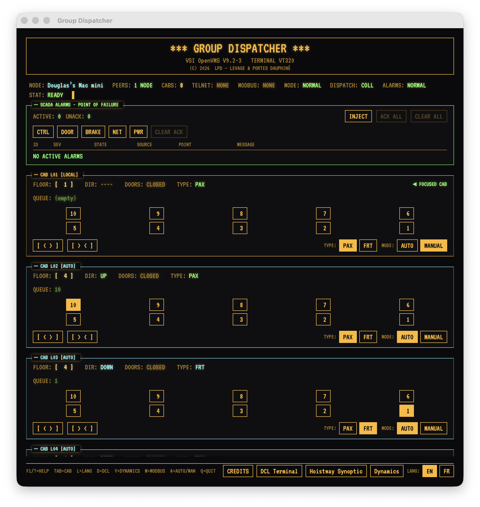
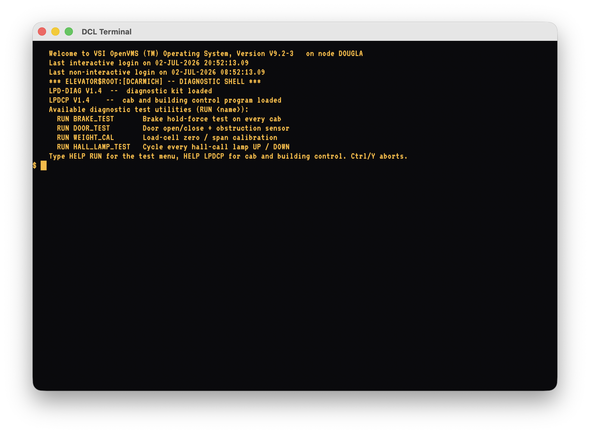
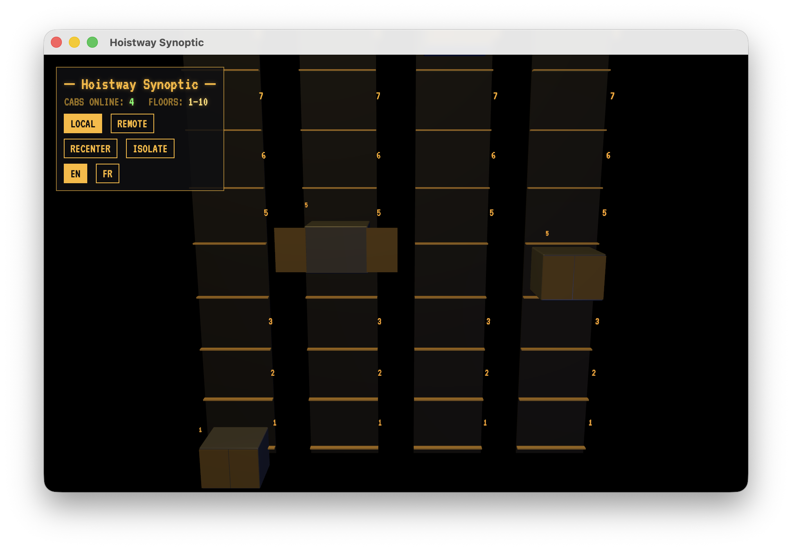
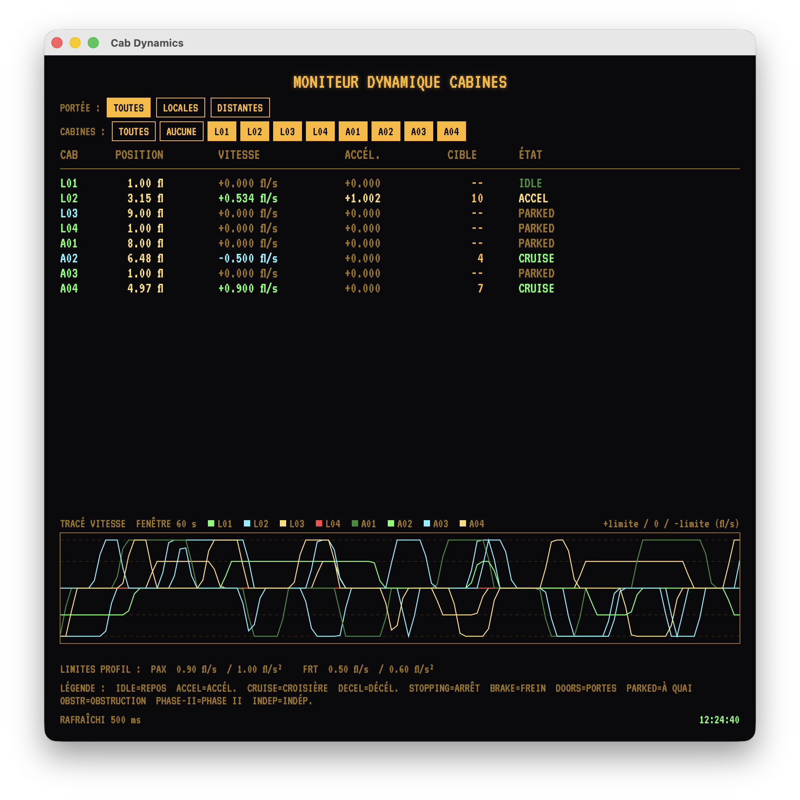
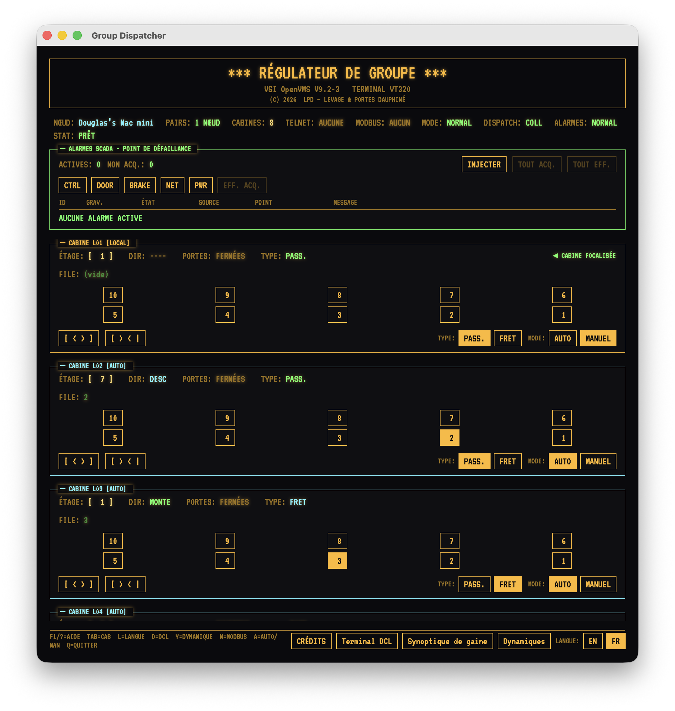
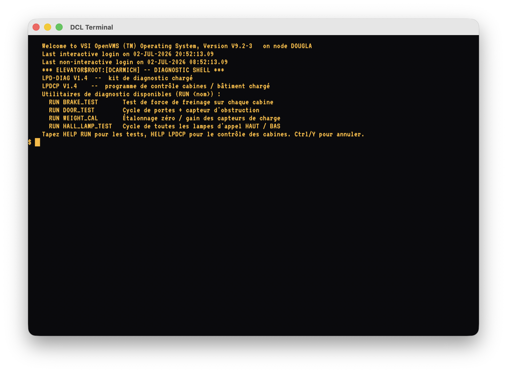
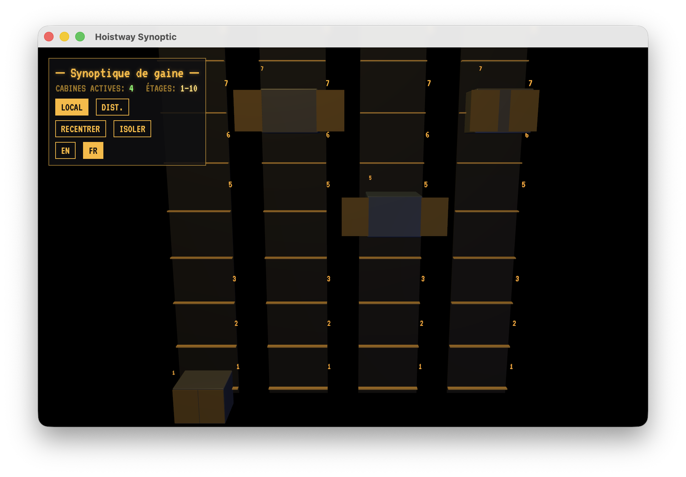
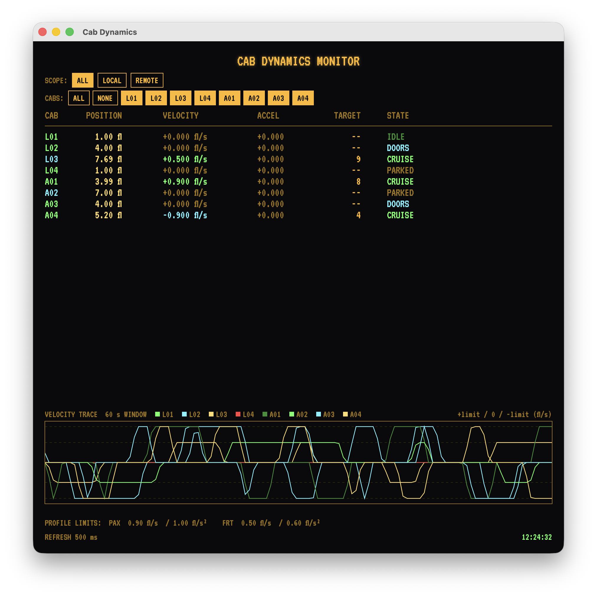

# ElevatorSystem

A standalone native macOS / SwiftUI elevator simulator. Retro VT320 /
OpenVMS-styled 2D controls in one window, a SceneKit 3D shaft view in
another, and an OpenVMS DCL terminal in a third. Bilingual (English /
French) with runtime language switching.

Un simulateur d'ascenseur natif macOS / SwiftUI autonome. Une interface
rétro VT320 / OpenVMS dans une fenêtre, une vue 3D SceneKit du puits dans
une autre, et un terminal DCL OpenVMS dans une troisième. Bilingue
(anglais / français) avec changement de langue en temps réel.

English · [Français](#français)

---

## English

When the app starts it publishes a Bonjour service (`_elevatorsys._tcp`)
and browses for other instances on the same LAN. If no peers appear
within a short grace period, the app auto-spawns a handful of
auto-controlled elevators so the scene is populated.

### Screenshots

| Group Dispatcher (VT320) | DCL Terminal | Hoistway Synoptic (3D) | Cab Dynamics |
|:---:|:---:|:---:|:---:|
|  |  |  |  |

### Requirements

- macOS 13 (Ventura) or later
- Xcode 15+ (Swift 5.9)
- [`xcodegen`](https://github.com/yonaskolb/XcodeGen): `brew install xcodegen`

### Build & run

```bash
xcodegen generate
open ElevatorSystem.xcodeproj
```

Then press ⌘R in Xcode. Or from the command line:

```bash
xcodebuild -project ElevatorSystem.xcodeproj \
           -scheme ElevatorSystem \
           -configuration Debug \
           -destination 'platform=macOS' build
```

The `.xcodeproj` is regenerated from `project.yml` by xcodegen and is
`.gitignore`'d — edit `project.yml` and re-run `xcodegen generate` to
change build settings, not the project file directly.

### Features

- **SCADA alarm panel** — CTRL / DOOR / BRAKE / NET / PWR fault indicators
  with injection, acknowledgment, and severity tracking
- **OpenVMS-style DCL terminal** with diagnostic test utilities
  (`BRAKE_TEST`, `DOOR_TEST`, `WEIGHT_CAL`, `HALL_LAMP_TEST`)
- **MONITOR utility** displaying live system, process, I/O, memory, disk,
  lock, and cluster statistics
- **Modbus TCP server** on port 5020 — connect any standard Modbus client
  to read and write elevator state in real time (see
  [Modbus TCP Interface](#modbus-tcp-interface) below)
- **Multi-peer elevator control** over the local network via Bonjour
- **Auto-driven elevators** that spawn when no peers are detected
- **Passenger / freight dispatch** — per-cabin PAX / FRT profile switching
- **Bilingual UI** (English / French) with runtime switching

### Modbus TCP Interface

ElevatorSystem exposes a Modbus TCP server at `127.0.0.1:5020`
(Unit ID 1). Any standard Modbus client — QModMaster, ModRSsim2,
pymodbus, Node-RED, or a PLC configured as a Modbus TCP client — can
connect to the running simulation and interact with elevator state in
real time.

Per-cabin registers use 16-register offsets (cabin 0 = addresses 0–15,
cabin 1 = 16–31, etc.). System-wide registers begin at address 1000.

#### Input Registers — FC 04, read-only

| Address | Description |
|---|---|
| 0..15 | Position × 10 |
| 16..31 | Direction (0 = idle, 1 = up, 2 = down) |
| 32..47 | Door state (0 = closed … 3 = closing) |
| 48..63 | Queue depth |
| 64..79 | Door progression × 100 |
| 80..95 | Velocity × 100 (Int16, signed) |
| 96..111 | Platform load (kg) |
| 1000 | Number of cabins |
| 1001 | Number of peers |
| 1002 | Building floors |
| 1003 | Telnet sessions |
| 1004 | Modbus clients |
| 1005 | Building mode (0 = normal, 1 = fire, 2 = stop) |
| 1006 | Recall floor |
| 1007 | Active alarms |
| 1008 | Max severity |
| 1009 | Dispatch mode (0 = collective, 1 = destination) |
| 1010 | Active landing calls |

#### Holding Registers — FC 03 read, FC 06 write

| Address | Description |
|---|---|
| 0..15 | Profile (0 = PAX, 1 = FRT) |
| 16..31 | Mode (0 = MAN, 1 = AUTO) |
| 32..47 | Target floor — write to dispatch |

#### Coils — FC 01 read, FC 05 write

| Address | Description |
|---|---|
| 0..15 | Open doors (impulse) |
| 16..31 | Close doors |
| 32..47 | Emergency stop / cancel queue |

#### Discrete Inputs — FC 02, read-only

| Address | Description |
|---|---|
| 0..15 | Cabin local |
| 16..31 | Cabin in motion |
| 32..47 | Doors open |
| 48..63 | Parking brake engaged |
| 64..79 | Door obstruction cell |
| 80..95 | Overload (>110%) |

### Architecture

- **`ElevatorWorld`** (`@MainActor` `ObservableObject`) owns the
  authoritative list of `Elevator` values and runs the 60 Hz physics tick
  that drives floor travel and door state machines.
- **`PeerNetwork`** uses Network.framework (`NWListener` + `NWBrowser`)
  to publish a Bonjour service per app instance and discover other
  instances. Newline-delimited JSON messages (`hello` / `state` /
  `remove` / `bye`) carry peer state. Each elevator carries an
  `ownerPeerId`; remote elevators show in the UI but only the owning
  peer can mutate them.
- **`AutoDriver`** waits a short grace period after launch and, if no
  peers have joined, spawns `Sim.autoSpawnCount` autonomous elevators
  that pick random destination floors on their own.
- **`ControlPanelWindow`** is the VT320-styled 2D control room. The
  language toggle lives in the footer (`[EN] [FR]`). Each `BoxPanel`
  represents one elevator with floor pad, door buttons, queue line, and
  a `[LOCAL] / [AUTO] / [REMOTE]` tag.
- **`ElevatorSceneView`** wraps an `SCNView` in an `NSViewRepresentable`.
  The `Coordinator` reconciles SceneKit nodes against `ElevatorWorld`
  state on every change — one shaft per elevator, with sliding doors
  driven by `doorProgress` and a luminous floor readout.
- **`ModbusServer`** runs a Modbus TCP listener on port 5020 and maps
  function codes to `ElevatorWorld` state. Input registers and discrete
  inputs are read from the simulation; holding registers and coils write
  back into it.
- **DCL terminal** provides an OpenVMS-style shell with the diagnostic
  test utilities and the MONITOR live-stats viewer.

### Bonjour & networking

Both `com.apple.security.network.client` and `...network.server` are
granted in the entitlements file; the App Sandbox itself is disabled in
this development configuration. The first launch will trigger the
system local-network privacy prompt — accept it for peer discovery to
work. The Bonjour usage description and service type are set in
`project.yml` under `NSLocalNetworkUsageDescription` and
`NSBonjourServices`.

### Cluster daemon (headless back-end)

`ClusterDaemon/` is a separate, self-contained **SwiftPM package** — not part
of the app's XcodeGen build — that runs headless as a cross-platform back-end
on **macOS, Linux, and Windows**. It simulates one or more OpenVMS-style
dispatcher *nodes*, each owning its own cluster of auto-driven cabs, and
publishes them on the LAN over the same Bonjour peer protocol the app speaks.
Run it next to the app and its cabs appear as `[REMOTE]` peers in the Group
Dispatcher, animate in the Hoistway Synoptic 3D view, and list under
`MONITOR CLUSTER` in the DCL terminal — so you can **demonstrate the
multi-peer networking without a second machine**.

The transport is pluggable: on macOS it uses Bonjour / Network.framework; on
Linux and Windows a hand-rolled, dependency-free mDNS + BSD-socket stack
speaks the byte-identical wire, so a daemon on a Linux box is discovered by
the macOS app exactly like another Mac would be (Foundation only, no external
dependencies).

```bash
cd ClusterDaemon && swift build && swift run elevator-clusterd --nodes 3 --cabs 2
```

See `ClusterDaemon/README.md` for all flags and demo recipes.

### Layout

```
project.yml                            XcodeGen spec (source of truth)
Resources/
  Info.plist                           Generated by xcodegen from project.yml
  ElevatorSystem.entitlements          Network client + server, sandbox off
  Assets.xcassets/                     App icon
Sources/ElevatorSystem/
  ElevatorSystemApp.swift              @main, three WindowGroups
  Models/                              Elevator, ElevatorWorld, Constants
  Localization/                        AppLanguage, Strings (EN/FR)
  Networking/                          Bonjour discovery + peer protocol
  Automation/                          Autonomous elevator driver
  DCL/                                 OpenVMS DCL shell + MONITOR utility
  Modbus/                              Modbus TCP server (port 5020)
  Views/                               Retro theme, control panel, 3D scene, DCL terminal
ClusterDaemon/                         Headless cluster-peer daemon (SwiftPM; macOS/Linux/Windows)
```

---

## Français

Au démarrage, l'application publie un service Bonjour (`_elevatorsys._tcp`)
et recherche d'autres instances sur le même réseau local. Si aucun pair
n'apparaît pendant une courte période, l'application génère automatiquement
quelques ascenseurs autonomes pour peupler la scène.

### Captures d'écran

| Régulateur de groupe (VT320) | Terminal DCL | Synoptique de gaine (3D) | Dynamique cabines |
|:---:|:---:|:---:|:---:|
|  |  |  |  |

### Prérequis

- macOS 13 (Ventura) ou plus récent
- Xcode 15+ (Swift 5.9)
- [`xcodegen`](https://github.com/yonaskolb/XcodeGen) : `brew install xcodegen`

### Compilation et lancement

```bash
xcodegen generate
open ElevatorSystem.xcodeproj
```

Puis ⌘R dans Xcode. Ou en ligne de commande :

```bash
xcodebuild -project ElevatorSystem.xcodeproj \
           -scheme ElevatorSystem \
           -configuration Debug \
           -destination 'platform=macOS' build
```

Le `.xcodeproj` est régénéré à partir de `project.yml` par xcodegen et
est ignoré par git — modifiez `project.yml` et relancez `xcodegen
generate` pour changer les réglages de build, pas le fichier projet
directement.

### Fonctionnalités

- **Panneau d'alarmes SCADA** — indicateurs de défaillance CTRL / DOOR /
  BRAKE / NET / PWR avec injection, acquittement et suivi de sévérité
- **Terminal DCL style OpenVMS** avec utilitaires de diagnostic
  (`BRAKE_TEST`, `DOOR_TEST`, `WEIGHT_CAL`, `HALL_LAMP_TEST`)
- **Utilitaire MONITOR** affichant les statistiques en temps réel :
  système, processus, E/S, mémoire, disque, verrous et cluster
- **Serveur Modbus TCP** sur le port 5020 — connectez n'importe quel
  client Modbus standard pour lire et écrire l'état des ascenseurs en
  temps réel (voir [Interface Modbus TCP](#interface-modbus-tcp) ci-dessous)
- **Contrôle multi-pairs** sur le réseau local via Bonjour
- **Ascenseurs automatiques** générés en l'absence de pairs
- **Régulation passagers / fret** — profil PAX / FRT par cabine
- **Interface bilingue** (anglais / français) avec changement en temps réel

### Interface Modbus TCP

ElevatorSystem expose un serveur Modbus TCP à l'adresse `127.0.0.1:5020`
(Unit ID 1). N'importe quel client Modbus standard — QModMaster,
ModRSsim2, pymodbus, Node-RED ou un automate configuré en client
Modbus TCP — peut se connecter à la simulation et interagir avec l'état
des ascenseurs en temps réel.

Les registres par cabine utilisent des décalages de 16 registres
(cabine 0 = adresses 0–15, cabine 1 = 16–31, etc.). Les registres
système commencent à l'adresse 1000.

#### Registres d'entrée — FC 04, lecture seule

| Adresse | Description |
|---|---|
| 0..15 | Position × 10 |
| 16..31 | Direction (0 = repos, 1 = montée, 2 = descente) |
| 32..47 | État portes (0 = fermée … 3 = fermeture) |
| 48..63 | Profondeur file |
| 64..79 | Progression portes × 100 |
| 80..95 | Vitesse × 100 (Int16, signé) |
| 96..111 | Charge plateau (kg) |
| 1000 | Nombre de cabines |
| 1001 | Nombre de pairs |
| 1002 | Étages bâtiment |
| 1003 | Sessions telnet |
| 1004 | Clients modbus |
| 1005 | Mode bâtiment (0 = normal, 1 = feu, 2 = arrêt) |
| 1006 | Étage de rappel |
| 1007 | Alarmes actives |
| 1008 | Sévérité max |
| 1009 | Régulation (0 = collective, 1 = destination) |
| 1010 | Appels palier actifs |

#### Registres de maintien — FC 03 lecture, FC 06 écriture

| Adresse | Description |
|---|---|
| 0..15 | Profil (0 = PAX, 1 = FRT) |
| 16..31 | Mode (0 = MAN, 1 = AUTO) |
| 32..47 | Étage cible — écrire pour appeler |

#### Bobines — FC 01 lecture, FC 05 écriture

| Adresse | Description |
|---|---|
| 0..15 | Commande ouvrir portes (impulsion) |
| 16..31 | Commande fermer portes |
| 32..47 | Arrêt d'urgence / annuler file |

#### Entrées TOR — FC 02, lecture seule

| Adresse | Description |
|---|---|
| 0..15 | Cabine locale |
| 16..31 | Cabine en mouvement |
| 32..47 | Portes ouvertes |
| 48..63 | Frein de stationnement serré |
| 64..79 | Cellule porte obstruée |
| 80..95 | Cabine en surcharge (>110 %) |

### Architecture

- **`ElevatorWorld`** (`@MainActor` `ObservableObject`) détient la liste
  de référence des valeurs `Elevator` et exécute le tick physique à 60 Hz
  qui pilote le déplacement entre étages et les machines à états des
  portes.
- **`PeerNetwork`** utilise Network.framework (`NWListener` + `NWBrowser`)
  pour publier un service Bonjour par instance et découvrir les autres.
  Des messages JSON délimités par saut de ligne (`hello` / `state` /
  `remove` / `bye`) transportent l'état des pairs. Chaque ascenseur
  porte un `ownerPeerId` ; les ascenseurs distants s'affichent dans
  l'interface mais seul le pair propriétaire peut les modifier.
- **`AutoDriver`** attend une courte période après le lancement et, si
  aucun pair ne s'est connecté, génère `Sim.autoSpawnCount` ascenseurs
  autonomes qui choisissent des étages de destination aléatoires.
- **`ControlPanelWindow`** est la salle de contrôle style VT320. Le
  sélecteur de langue se trouve dans le pied de page (`[EN] [FR]`).
  Chaque `BoxPanel` représente un ascenseur avec pavé d'étages, boutons
  de portes, file d'attente et étiquette `[LOCAL] / [AUTO] / [REMOTE]`.
- **`ElevatorSceneView`** encapsule un `SCNView` dans un
  `NSViewRepresentable`. Le `Coordinator` réconcilie les nœuds SceneKit
  avec l'état d'`ElevatorWorld` à chaque changement — un puits par
  ascenseur, avec des portes coulissantes pilotées par `doorProgress`
  et un afficheur d'étage lumineux.
- **`ModbusServer`** exécute un listener Modbus TCP sur le port 5020 et
  mappe les codes fonction vers l'état d'`ElevatorWorld`. Les registres
  d'entrée et les entrées TOR sont lus depuis la simulation ; les
  registres de maintien et les bobines y écrivent.
- **Terminal DCL** fournit un shell style OpenVMS avec les utilitaires de
  diagnostic et le visualiseur de statistiques en temps réel MONITOR.

### Bonjour et réseau

Le client et le serveur réseau sont autorisés dans le fichier
d'entitlements ; le bac à sable applicatif est désactivé dans cette
configuration de développement. Au premier lancement, macOS affiche
l'invite de confidentialité réseau local — acceptez-la pour que la
découverte des pairs fonctionne. La description d'usage et le type de
service Bonjour sont définis dans `project.yml` sous
`NSLocalNetworkUsageDescription` et `NSBonjourServices`.

### Démon de cluster (back-end headless)

`ClusterDaemon/` est un **paquet SwiftPM** autonome et distinct — hors de la
build XcodeGen de l'application — qui s'exécute en mode headless comme
back-end multi-plateforme sur **macOS, Linux et Windows**. Il simule un ou
plusieurs nœuds régulateurs de style OpenVMS, chacun possédant son propre
cluster de cabines autonomes, et les publie sur le réseau local via le même
protocole Bonjour que l'application. Lancé à côté de l'application, ses
cabines apparaissent comme pairs `[REMOTE]` dans le Régulateur de groupe,
s'animent dans la vue 3D Synoptique de gaine et sont listées sous
`MONITOR CLUSTER` dans le terminal DCL — de quoi **démontrer le
fonctionnement multi-pair sans seconde machine**.

Le transport est enfichable : sur macOS il utilise Bonjour / Network.framework ;
sur Linux et Windows, un moteur mDNS + sockets BSD écrit à la main et sans
dépendance parle le même protocole au bit près, si bien qu'un démon sur une
machine Linux est découvert par l'application macOS exactement comme le serait
un autre Mac (Foundation uniquement, aucune dépendance externe).

```bash
cd ClusterDaemon && swift build && swift run elevator-clusterd --nodes 3 --cabs 2
```

Voir `ClusterDaemon/README.md` pour toutes les options et les exemples de démo.

### Structure

```
project.yml                            Spec XcodeGen (source de vérité)
Resources/
  Info.plist                           Généré par xcodegen depuis project.yml
  ElevatorSystem.entitlements          Client + serveur réseau, sandbox off
  Assets.xcassets/                     Icône de l'application
Sources/ElevatorSystem/
  ElevatorSystemApp.swift              @main, trois WindowGroups
  Models/                              Elevator, ElevatorWorld, Constants
  Localization/                        AppLanguage, Strings (EN/FR)
  Networking/                          Découverte Bonjour + protocole pair
  Automation/                          Pilote d'ascenseur autonome
  DCL/                                 Shell DCL OpenVMS + utilitaire MONITOR
  Modbus/                              Serveur Modbus TCP (port 5020)
  Views/                               Thème rétro, panneau de contrôle, scène 3D, terminal DCL
ClusterDaemon/                         Démon de cluster headless (SwiftPM ; macOS/Linux/Windows)
```

---

## Credits / Crédits

| | |
|---|---|
| **Original concept & design / Concept et design original** | Amaury Crocquefer — amaury@crocque.fr |
| | https://github.com/lapatatedouce59/elevatorSystem |
| **macOS / SwiftUI port / Portage macOS / SwiftUI** | Douglas Carmichael — dcarmich@dcarmichael.net |
| | https://github.com/douglas-carmichael/elevatorSystem |
